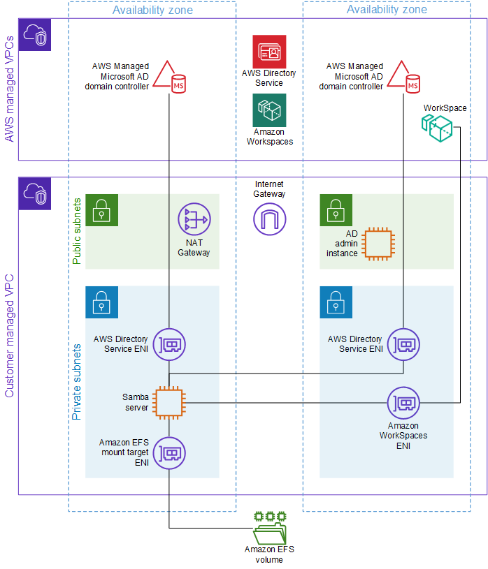

# How to access Amazon Elastic File System volumes from Windows hosts using Samba with Active Directory integration
This project enables access to Amazon Elastic File System (EFS) volumes from Windows hosts (e.g. Amazon WorkSpaces, Amazon EC2 instances) in a Microsoft Active Directory domain. It will create an EFS volume and mount points, and an EC2 instance(s) that will mount the volume, configure itself as a Samba server, and read account and group information from the Active Directory (AD). Users logging in to their Windows environment can get access to their file share automatically via a pre-configured network location in their profile or by connecting to the network location manually.

## Architecture


## Prerequisites
* Terraform
* The following Terraform modules from the [terraform AWS modules](https://github.com/terraform-aws-modules) project (either via Internet or in local repos):
  * [terraform-aws-efs](https://github.com/terraform-aws-modules/terraform-aws-efs)
  * [terraform-aws-ec2-instance](https://github.com/terraform-aws-modules/terraform-aws-ec2-instance)
* A VPC with public and private subnets.
* A Microsoft Active Directory deployed or available in the VPC and administrator access. You can use instructions in the [AWS Managed Microsoft AD](#aws-managed-microsoft-ad) section below to create one. If this prerequisite is already satisfied, you can skip the instructions related to creating the AD and administration instance.
* Windows hosts, e.g. Amazon WorkSpace or Amazon EC2 instance, that are joined to the AD domain. You can use instructions in the [Amazon WorkSpaces](#amazon-workspaces) section below to create a WorkSpace. Alternatively, you can use the instructions in [Seamlessly join a Windows EC2 instance](https://docs.aws.amazon.com/directoryservice/latest/admin-guide/launching_instance.html) to launch an EC2 instance and join it to the domain.
* Optional parameter in Parameter Store with CIDR blocks for remote instances referenced in security group rules. This example uses a parameter named `remote_instances_cidr_blocks`, but this can be changed in the `sg.tf` file. For example:
```
99.99.99.98/32,99.99.99.99/32
```

### AWS Managed Microsoft AD
* Create a fully managed MAD using [AWS Managed Microsoft AD](https://docs.aws.amazon.com/directoryservice/latest/admin-guide/ms_ad_getting_started.html). On the **Choose VPC and subnets** page, select private subnets.
* Create a parameter in Parameter Store with the name "/${var.project_name}/${var.project_env}/ad/admin" and of type SecureString, and copy the Admin password from the previous step into **Value**.
* [Create a DHCP options set](https://docs.aws.amazon.com/directoryservice/latest/admin-guide/dhcp_options_set.html) for the directory service and assign it to the VPC that your directory is in.
* [Launch a directory administration EC2 instance](https://docs.aws.amazon.com/directoryservice/latest/admin-guide/console_instance.html) to use for managing users and groups in the directory. This automation uses the "AWS-CreateDSManagementInstance" automation document. Leave the RemoteAccessCIDR parameter field blank and let the automation create the IAM roles.
  * The document retrieves the subnet for launching the EC2 instance using the `DescribeDirectories` API call, which returns the IDs of subnets where the elastic network interfaces deployed by Directory Service into your VPC are located. Therefore, if you specified private subnets for the directory, the instance will also launch in a private subnet and will not have a public IP address. The automation still works, and you can access the instance via Session Manager, but you will have to use a "jump box" in the VPC to access the instance via Remote Desktop Protocol (RDP). To access the instance directly via RDP, copy the automation document, change the `SubnetId` in the `LaunchInstance` step to a public subnet ID, and make sure that subnet has "Auto-assign public IPv4 address" is enabled; alternatively, if you will be reusing this document, you could add some additional logic and steps to retrieve a public subnet ID as part of the automation.
  * After the automation has completed, modify the security group attached to the instance to allow TCP port 3389 from the CIDR block you will use to access the instance via remote desktop protocol (RDP).
* From the Directory Service console, choose the directory and then choose the instance ID listed under **Directory administration EC2 instance**. Connect to the administration instance using the RDP client using the instructions from the [documentation](https://docs.aws.amazon.com/AWSEC2/latest/WindowsGuide/connecting_to_windows_instance.html#connect-rdp) or in the [section](#ec2-instance---connect-to-the-windows-server-using-rdp). For a directory named `corp.example.com`, sign in with the username `admin@corp.example.com` or `corp\admin` and use the password you created when launching the directory.
* [Create users](https://docs.aws.amazon.com/directoryservice/latest/admin-guide/ms_ad_manage_users_groups_create_user.html) using the Active Directory Users and Computers (ADUC) tool, e.g. `user1` and `user2`. These users should also be listed in the `local.samba.users` variable in the example Samba server deployment `locals.tf` file.
* Enable the Advanced Features mode, by selecting the domain, i.e. `corp`, choose **View**, then select **Advanced Features**.
* [Create a group](https://docs.aws.amazon.com/directoryservice/latest/admin-guide/ms_ad_manage_users_groups_create_group.html) using the ADUC tool, e.g. `workspaces`, and set values for the `gidNumber` and `msSFUNisDomain` attributes that should be visible in the Attribute Editor tab enabled in the previous step; use `20000` and `corp`, respectively. Note that values must be within the `idmap config CORP:range` specified in the smb.conf file, which is created in the user-data. See the [`ad` ID mapping backend](https://wiki.samba.org/index.php/Idmap_config_ad) guidance for more details.
* Select the user created in a previous step and set values for the `gidNumber`, `msSFUNisDomain`, and `uidNumber` attributes; use `20000`, `corp`, and `10001` (or values that correspond to the group ID and domain used for the group created above). If you created multiple users, use unique values for `uidNumber`, e.g. `10001`, `10002`, etc.

### Amazon Workspaces
* [Register the directory with WorkSpaces](https://docs.aws.amazon.com/workspaces/latest/adminguide/register-deregister-directory.html). Two subnets are required - select private subnets in the same (or connected) VPC.
* [Launch a WorkSpace using AWS Managed Microsoft AD](https://docs.aws.amazon.com/workspaces/latest/adminguide/launch-workspace-microsoft-ad.html). Skip the **Create User** page by choosing **Next**. On the **Identify Users** page, choose the user you created above. On the **Select Bundle** page, choose a version of Windows Server from the Standard tab that is "Free tier eligible".
* While the WorkSpace availability is pending, continue with instructions for the example below. 

## Deploy

### Examples
* For illustration purposes, the examples assume a directory structure like below. The examples include separate stacks for the security group, IAM, and EFS/server resources - this is for ease of deployment by customers that require separation of duties/permissions along these boundaries. For customers that don't have this requirement, the stacks can easily be combined for a more streamlined deployment.
```
.
└── repos
    ├── efs-windows
    └── live
        └── efs-windows
            └── dev
```

#### Samba server with AD integration
* Copy the folders and files from `./examples/ad` to a repo/directory with configuration data, e.g. `../live/efs-windows/dev/`.
* Update the `env.config` file based on definitions in `variables.tf` and export the variables into the environment.
* Review the values in each file before deploying, particularly those in the `locals` section or `locals.tf` file.
* Specify an EC2 instance type (in `instance_type`) that supports [simplified automatic recovery](https://docs.aws.amazon.com/AWSEC2/latest/UserGuide/ec2-instance-recover.html) so, in case of an event, the server will recover with the same IP address and preserve the network mapping from the Windows hosts.
* If necessary, update the `source` property for each Terraform module that is used (e.g. if deploying to `aws-iso` regions).
* Deploy the stacks
```bash
# From the config directory
cd ../live/efs-windows/dev/sg
terraform init
terraform apply
cd ../iam
terraform init
terraform apply
cd ..
terraform init
terraform apply
```

## Test
* Connect to the Samba server using Session Manager.
* Verify that you can retrieve information about the users and groups you created from the directory. Note that this only works for users and groups that have the required attributes specified above. See the [References](#references) section for more details.
```bash
# Examples
getent passwd corp\\user1 # or use quotes and single backslash, e.g. "corp\user1"
getent group corp\\workspaces
```
* OPTIONAL: Access the directory administration instance and [use the ADUC tool to configure each user's home folder](https://wiki.samba.org/index.php/Windows_User_Home_Folders#Using_Active_Directory_Users_and_Computers) to map to their Samba share mounted to the EFS volume. Note that you can do this before or after the user directories have been created on the Samba server. If the latter, you will get a warning (that you can acknowledge) and AD will create a folder for that user owned by `root` in the Samba `users` share, which must be changed for the user to access it. Example: `\\10.0.x.x\users\user1`.
* [Login to the WorkSpace](#amazon-workspace) with the Amazon WorkSpaces client or into an EC2 instance using [RDP](#ec2-instance---connect-to-the-windows-server-using-rdp) with credentials for the appropriate user; for the latter, remember to use the domain name in the user name, e.g. `corp\user1`. Open **File Explorer** and verify that their home folder in the EFS volume is available under **This PC** (if configured per previous step) or connect to the user's Samba share by [adding a network location](#add-a-network-location-for-the-samba-share).
* Test access controls by creating additional users and logging in to additional WorkSpaces (or logging in on the Samba server itself as different users).

### EC2 instance - connect to the Windows server using remote desktop protocol (RDP)
* The easiest way is to use the RDP client option accessed via the Connect button.
* Download the RDP shortcut file and save to use with the Remote Desktop application.
* If logging in as the local Administrator (not part of the directory domain), upload the private key to get the RDP password. Copy the password to use with the Remote Desktop application.
* Open the shortcut file or open Remote Desktop from your local machine, select **Show Options**, then open the shortcut file. 
  * If logging in as the local Administrator, enter the password copied in the step above for the local Administrator.
  * If logging in as the directory Admin (or other domain user), choose **More choices** and then **Use a different account**. Sign in with the username `admin@corp.example.com` or `corp\admin` and use the password you created when launching the directory.
* After the desktop appears, you will be asked "Do you want to allow your PC to be discoverable...?" Choose **Yes**.

### Amazon WorkSpace
* Complete the steps to [get started with the Amazon WorkSpace](https://docs.aws.amazon.com/workspaces/latest/userguide/workspaces-user-getting-started.html)

### Add a network location for the Samba share
* Once in the Windows host, open File Explorer, right click on **This PC**, choose **Add a network location**, choose **Next**, select **Choose a custom network location**.
* In the box labeled **Internet or network address:**, enter `\\<IP>\<workgroup>\<user>`, where `<IP>` is the IP address of a Samba server that was created (see output of `terraform apply`), `<workgroup>` is the directory workgroup, e.g. `corp`, and `<user>` is the name of the Linux user, e.g. `user1`.
* Create a file on the volume (can right-click on the network location, choose **New**, choose **Text Document**).
* Verify that you can see the file from any of the other hosts connected to the EFS file system (can use Session Manager to check on one of the Samba servers).
* If using the HA option, repeat for the other Samba servers.

## Update
* To update the Samba configuration, connect to the server using Session Manager, update the `smb.conf` file, and then reoload the configuration using the command `smbcontrol all reload-config`.
* You should run `terraform plan` in the appropriate config directory to verify changes before applying.

## Destroy
- Destroy the stacks
```bash
cd ../live/efs-windows/dev
terraform destroy
cd ../iam
terraform destroy
cd ../sg
terraform destroy
```

## Potential extensions
* [Create a group policy object in AD that automatically assigns the home folder for each user](https://wiki.samba.org/index.php/Windows_User_Home_Folders#Using_a_Group_Policy_Preference).
* You could create a DFS namespace and add the Samba share as a target path, then map the users' home folders via the namespace.
* You could create a high-availability deployment by launching multiple Samba servers configured for simplified automatic recovery in different AZs, deploy Windows DFS servers in a multi-AZ auto scaling group with the Samba share as a target path in a domain-based namespaces.

## References
* [Setting up Samba as a Domain Member](https://wiki.samba.org/index.php/Setting_up_Samba_as_a_Domain_Member)
* [`ad` ID mapping backend](https://wiki.samba.org/index.php/Idmap_config_ad)
* [Configuration file - `smb.conf`](https://www.samba.org/samba/docs/current/man-html/smb.conf.5.html)
* [Mapping UNIX attributes](https://wiki.samba.org/index.php/Installing_RSAT#Missing_Unix_Attributes_tab_in_ADUC_on_Windows_10_and_Windows_Server_2016)
